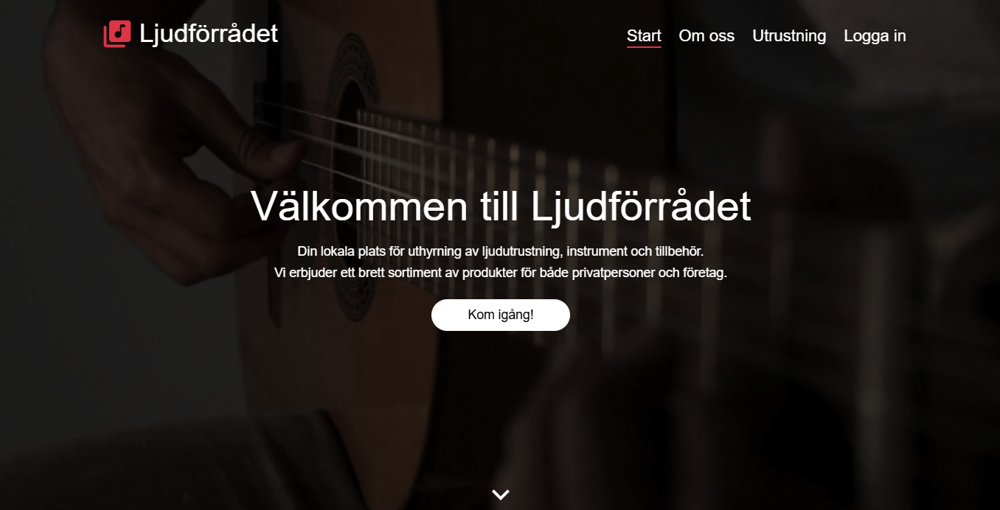
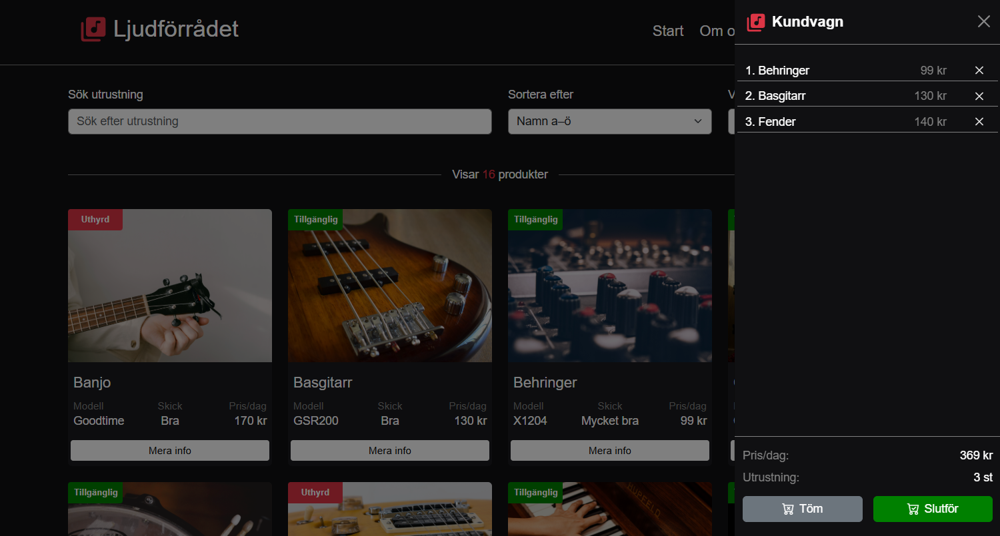
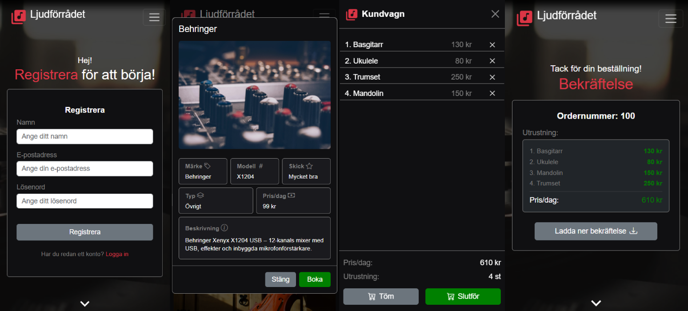
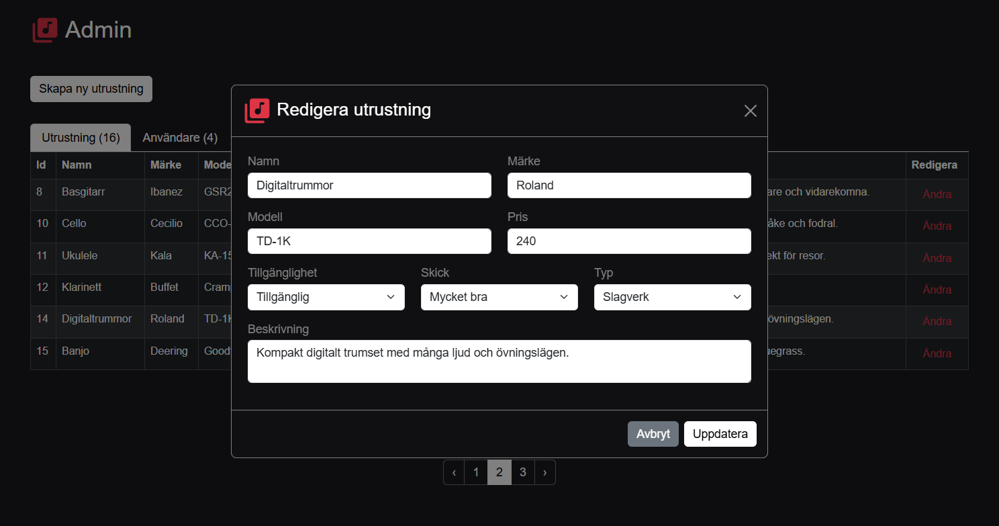
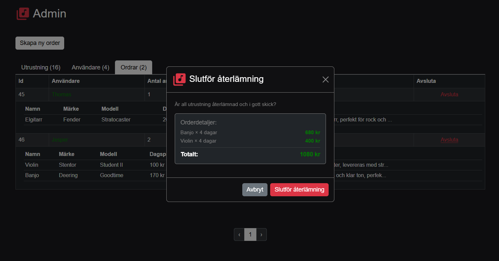

# Ljudförrådet 

A fullstack demo e-commerce app for audio equipment, built with C# and React/TypeScript.


## Tech Stack
- React with TypeScript
- C# ASP.NET Core
- SQLite
- Bootstrap 


## Try it out?
Demo Accounts:
| Role  | Email           | Password |
|-------|-----------------|----------|
| Admin | admin@admin.com | 123456   |
| User  | user@user.com   | 123456   |  

<br/>

Running `npm run dev` will serve both the frontend and backend.
``` bash
git clone https://github.com/Peppson/Ljudforradet.git &&
cd Ljudforradet &&
npm install &&
npm run dev
```


## Screenshots
  
  

### Responsive design
  

### Admin view
  
  

