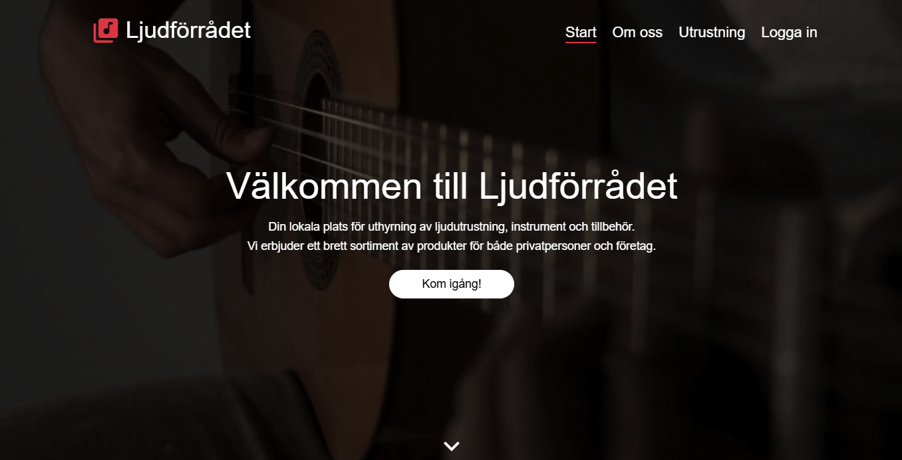
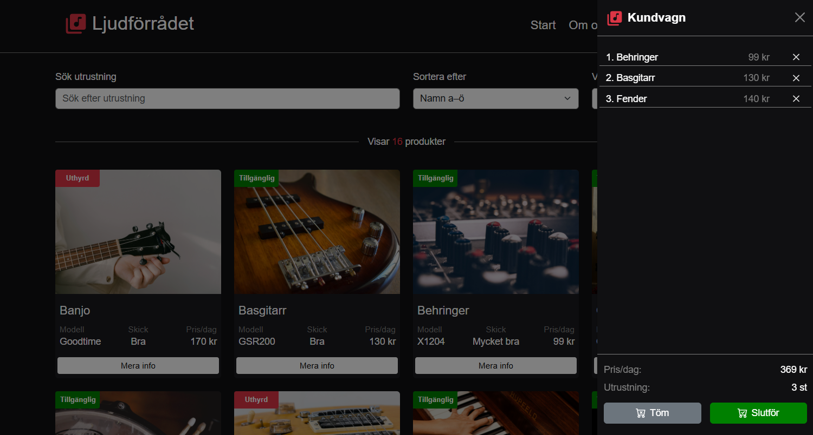
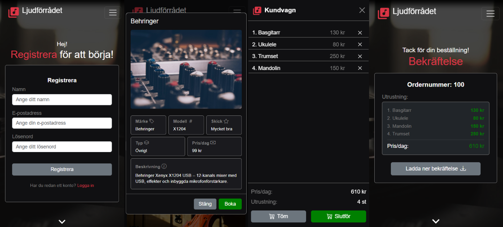
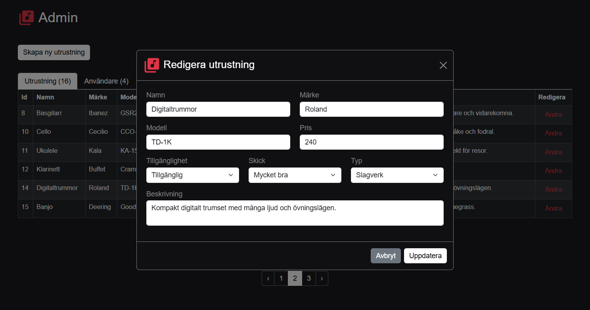
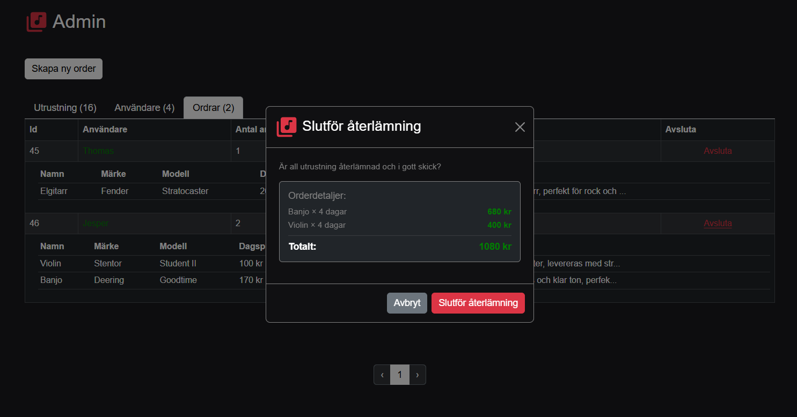

# Ljudförrådet  
A fullstack demo e-commerce app for audio equipment, built with React and C#.
>_This is a fictional app created for demonstration purposes, data is not real._


## Tech Stack
- React + TypeScript
- C# ASP.NET Core
- SQLite
- Styling with Bootstrap 


## Try it out locally?
Requirements:
- [.NET 8](https://dotnet.microsoft.com/en-us/download/dotnet/8.0)
- [Node v22](https://nodejs.org/)

Demo accounts:
| Role  | Email           | Password |
|-------|-----------------|----------|
| Admin | admin@admin.com | 123456   |
| User  | user@user.com   | 123456   |  

<br/>

Clone & Run:  
``` bash
git clone https://github.com/Peppson/Ljudforradet.git &&
cd Ljudforradet &&
npm install &&
npm run dev
```
*Running* `npm run dev` *will start both frontend and backend.*


## Screenshots
Home


Products
  

Responsive
  

Admin
  

  

[See all images](public/readme/)
